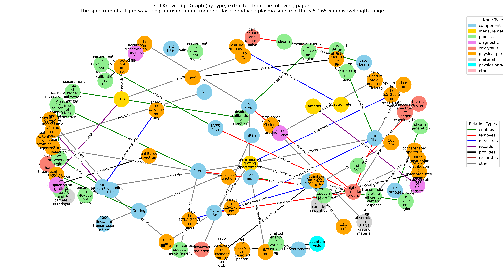
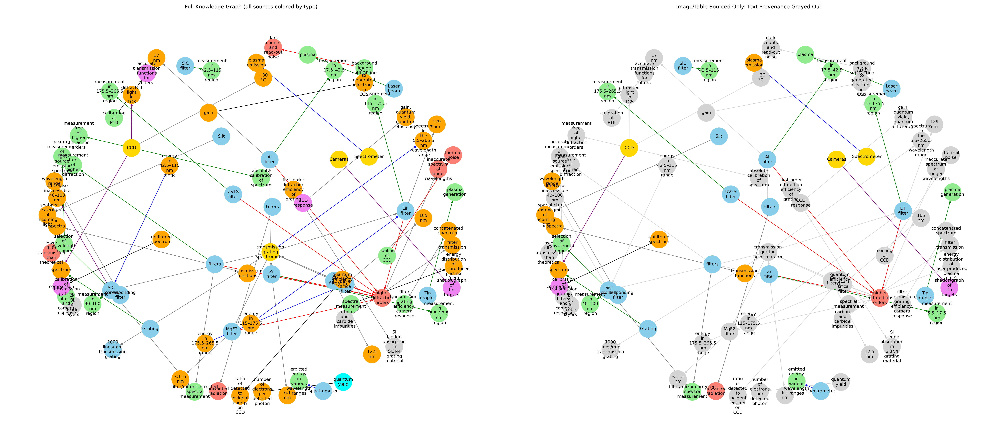
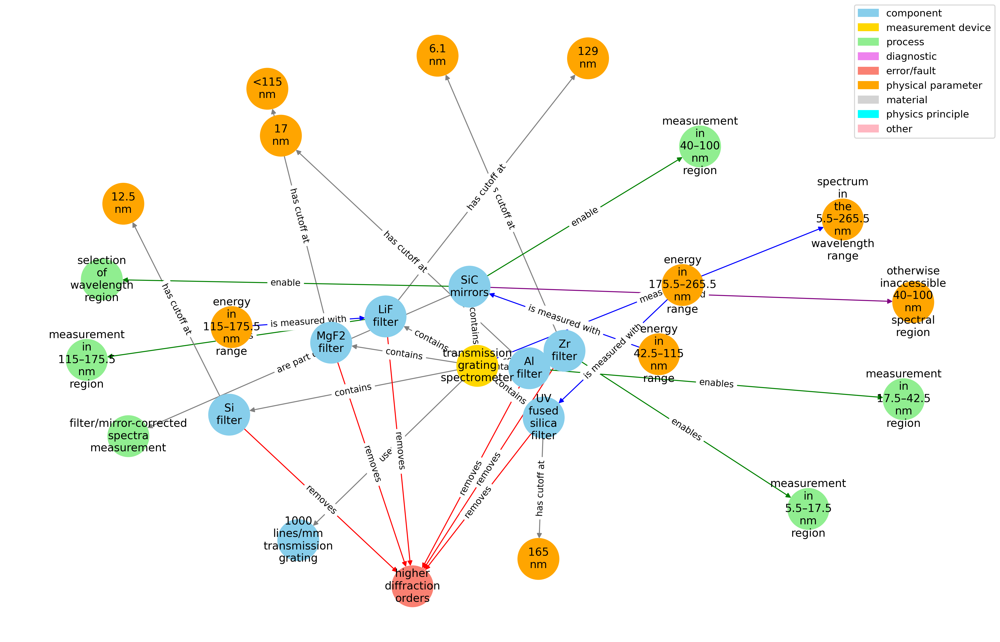

# Knowledge Graph Construction from a Multimodal EUV Spectrometer Paper

This repository demonstrates a mini-project where I automatically extract a **knowledge graph (KG)** from one of my peer-reviewed publications on EUV (Extreme Ultraviolet) spectrometry of plasma sources. The aim is to show, in a practical way, my motivation and interest in the intersection of machine learning, multimodal information extraction, and diagnostic reasoning for complex physical systems—directly aligned with the focus of the INDElab & ASML postdoc. It also serves as a jumping-off point for further development.

_Caveat:_ This is a **minimal viable product (MVP)** KG creating mini-project. There are several known issues and next steps listed at the bottom of this readme.

## Project Context

**Paper:**  
[Bouza, Z., Byers, J., Scheers, J., Schupp, R., Mostafa, Y., Behnke, L., ... & Versolato, O. O. (2021). The spectrum of a 1-μm-wavelength-driven tin microdroplet laser-produced plasma source in the 5.5–265.5 nm wavelength range. AIP advances, 11(12).](https://pubs.aip.org/aip/adv/article/11/12/125003/989461)

**Scientific context:**  
The paper details the design, operation, and results of a custom-built EUV spectrometer for analyzing plasma emission from tin microdroplets—a system of high relevance for EUV lithography and industrial partners like ASML.

**Project objective:**  
To build a prototype pipeline that:

- Extracts structured (subject, relation, object) triples from both text and figures/tables of a scientific paper.
- Merges and canonicalizes these triples to build a unified, semantically meaningful knowledge graph.
- Visualizes the graph to support diagnostic reasoning or further downstream analysis.

## Approach

- **PDF to text pre-processing**
  `notebooks/extract_text_01.ipynb` uses the `PyMuPDF` (fitz) package and regular expression text processing a raw text file from the PDF of the paper.
- **Text and figure extraction:**  
  `notebooks/create_kg_v01.ipynb` uses OpenAI’s GPT models to extract key subject-relation-object blocks of the physical components, processes, measurements, and errors from paper text and from selected images/tables (e.g., instrument schematics, experimental data). It also tags objects and relations with their "type" (e.g. "component", "measurement", "error/fault" ect. for nodes, e.g. "enables", "removes", "measures" etc. for relations), and their provenance (did the subject-object-relation come from the text, or a specific image?).
- **Canonicalization:**  
  Cleans and merges entity names, resolves duplicates, and unifies terminology between text and images (with some manual correction for edge cases).
- **Knowledge graph construction:**  
  Builds and visualizes the resulting graph using `networkx`, coloring nodes and edges by type and provenance (text/image/table).
- **Analysis & visualization:**  
  Provides both the full graph and focused subgraphs (e.g., 2-hop neighborhood around the main instrument) to demonstrate reasoning possibilities.

## Example Results

**Figure 1:**  
  
_Full KG with all sources with coloured node types and relation types_

**Figure 2:**  
  
_Left: Full KG with all sources; Right: Only image/table-derived knowledge, text provenance grayed out._

**Figure 3:**  
  
_2-hop neighborhood around the main node: "transmission grating spectrometer"._

These graphs show how domain knowledge from text, figures, and tables can be automatically structured—laying a foundation for diagnostic reasoning and cross-modal information retrieval in complex scientific/engineering domains.

## Known Issues & Next Steps

- **Entity canonicalization:**  
  Currently, some entity normalization relies on manual correction (e.g., mapping “higher diffraction orders” and “higher-order diffraction”).
- **Limited entity typing:**  
  The extraction prompt is based on fixed allowed types. Future work could incorporate more granular or learned ontologies.
- **Small scale:**  
  This project processes a single paper for demonstration purposes; scaling to large corpora will require further automation and robustness.
- **Limited image understanding:**  
  Visual extraction is still primitive and relies on GPT's multimodal capabilities. Future versions might use specialist models or fine-tuned open-source models for diagrams or structured tables.

**Next steps:**

- Fully automate canonicalization and entity alignment.
- Incorporate more advanced multimodal models for table/figure understanding.
- Apply reasoning tasks on the KG (e.g., fault tracing, component function prediction).
- Generalize to other scientific domains and larger document sets.

---
